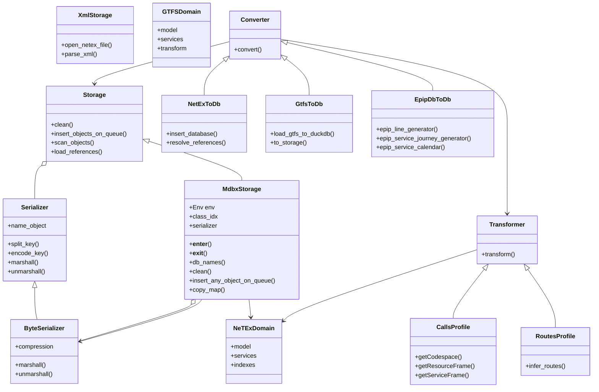
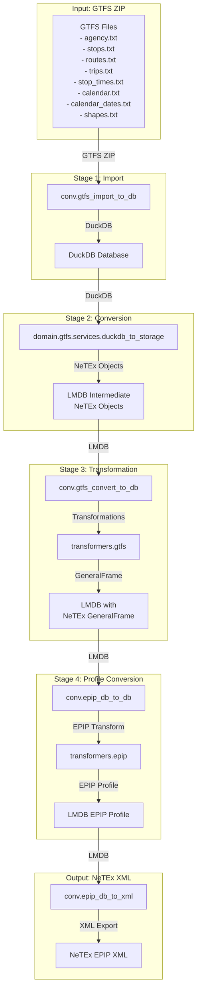
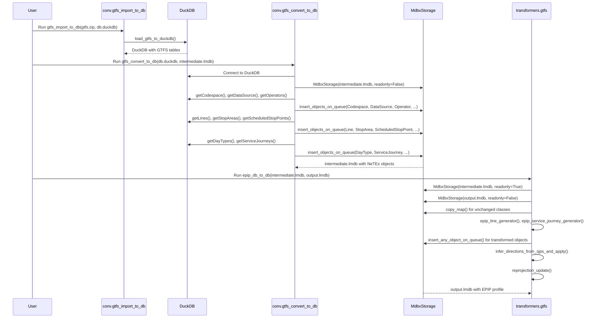
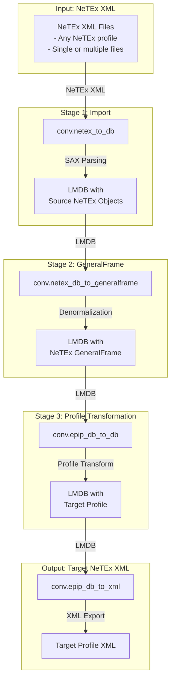
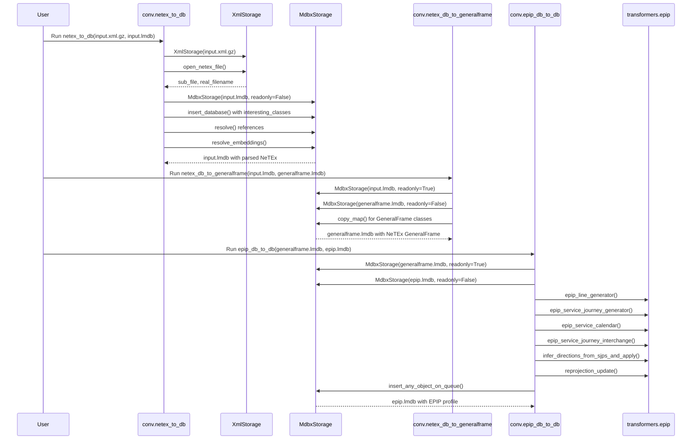
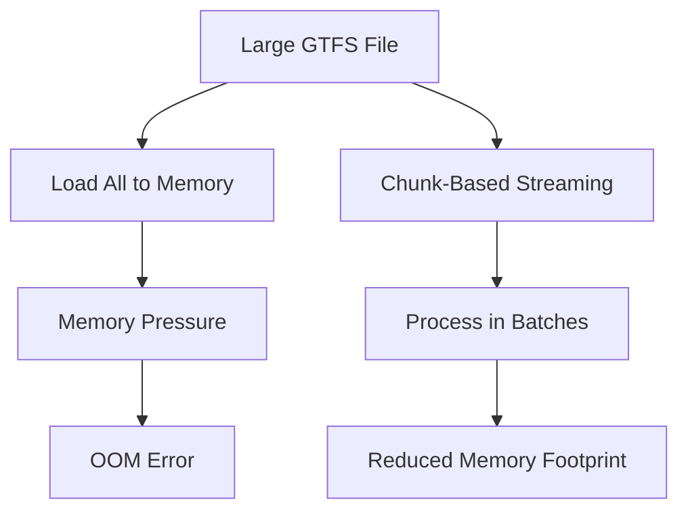

# Badger Architecture

## Table of Contents
1. [Overview](#overview)
2. [Folder Structure](#folder-structure)
3. [Core Components](#core-components)
4. [GTFS to NeTEx Conversion Chain](#gtfs-to-netex-conversion-chain)
5. [NeTEx to NeTEx Conversion Chain](#netex-to-netex-conversion-chain)
6. [Data Flow Diagrams](#data-flow-diagrams)
7. [Architecture Weaknesses and Bottlenecks](#architecture-weaknesses-and-bottlenecks)

---

## Overview

**Badger** is a high-performance timetable conversion system that transforms various transportation data formats (GTFS, NeTEx, IFF, etc.) into NeTEx objects, which can then be converted to different NeTEx profiles or other target formats. The system is designed with streaming and performance in mind while maintaining reproducibility.

### Key Design Principles

- **NeTEx as Intermediate Representation**: All data is converted to NeTEx objects first, which serve as the canonical intermediate format
- **Streaming Architecture**: Data processing uses generators and streaming to minimize memory usage
- **Audit Trail**: All information is preserved as-is with no proprietary intermediate representation
- **Schema Compliance**: Uses xsData for XML Schema compliance via Python Data Classes
- **High Performance**: Employs SAX-based XML parsing, task queues, and optimized database access

---

## Folder Structure

```
badger/
├── conv/                      # Conversion modules
│   ├── netex_to_db.py         # NeTEx XML to LMDB database
│   ├── gtfs_import_to_db.py   # GTFS ZIP to DuckDB import
│   ├── gtfs_convert_to_db.py  # DuckDB to LMDB conversion
│   ├── gtfs_db_to_db.py       # LMDB to LMDB GTFS transformation
│   ├── gtfs_db_to_gtfs.py     # LMDB to GTFS ZIP export
│   ├── epip_db_to_db.py       # EPIP profile transformation
│   ├── epip_db_to_xml.py      # EPIP LMDB to XML export
│   ├── netex_db_to_generalframe.py
│   └── ...
│
├── domain/                    # Domain models and business logic
│   ├── gtfs/                  # GTFS domain
│   │   ├── model/             # GTFS data models
│   │   ├── services/          # GTFS conversion services
│   │   └── transform/         # GTFS transformation logic
│   │
│   ├── netex/                 # NeTEx domain
│   │   ├── model/             # Generated NeTEx data classes (xsData)
│   │   ├── conf/              # Configuration files
│   │   ├── indexes/           # Indexing utilities
│   │   ├── schema/            # XML Schema definitions
│   │   ├── services/          # NeTEx service layer
│   │   └── model/             # Additional NeTEx models
│   │
│   └── trout/                 # Trout format support
│
├── storage/                   # Storage backends
│   ├── lmdb/                  # LMDB storage implementation
│   │   ├── core/              # Core LMDB operations
│   │   └── serialization/     # Serialization utilities
│   │
│   ├── mdbx/                  # MDBX storage (primary)
│   │   ├── core/              # MDBX implementation
│   │   └── serialization/     # Byte serialization
│   │
│   └── lxml/                  # LXML/SAX parsing
│       ├── core/              # XML parsing core
│       └── serialization/     # XML serialization
│
├── transformers/              # Format transformation logic
│   ├── gtfs.py                # GTFS-specific transformers
│   ├── epip.py                # EPIP profile transformers
│   ├── gtfsprofile.py         # GTFS profile handling
│   ├── nordicprofile.py       # Nordic profile
│   ├── dutch.py               # Dutch profile
│   ├── callsprofile.py        # Calls handling
│   ├── projection.py          # Coordinate projection
│   ├── direction.py           # Direction inference
│   ├── timedemandtypesprofile.py
│   └── ...
│
├── filter/                    # Data filtering
│   └── objects_in_polygon.py  # Geographic filtering
│
├── fix/                       # Data correction utilities
│   ├── day_offset.py          # Day offset corrections
│   ├── direction.py           # Direction fixes
│   ├── relational_constraints.py
│   └── ...
│
├── tools/                     # Command-line tools
│   ├── script_runner.py       # Batch processing
│   ├── gtfs_map_visualisation.py
│   ├── gtfs_validator.py
│   ├── netex_preproc_cleanup.py
│   └── tool_scripts/           # Predefined processing scripts
│
├── utils/                     # Utility functions
│   ├── aux_logging.py         # Logging utilities
│   ├── netex_monkeypatching.py
│   ├── refs.py                # Reference handling
│   └── utils.py               # General utilities
│
├── netexio/                   # Legacy/compatibility layer
│
├── gui/                       # Graphical user interface
│   └── ...
│
├── data/                      # Test and sample data
├── scripts/                   # Setup and utility scripts
├── test/                      # Test suites
│
└── configuration.py           # Global configuration
```

---

## Core Components

### Component Diagram



---

## GTFS to NeTEx Conversion Chain

### Overview

The GTFS to NeTEx conversion follows a multi-stage pipeline that ensures data integrity and performance through streaming and intermediate representations.

### Processing Stages



### Sequence Diagram: GTFS to NeTEx



### Command-Line Flow

```bash
# Stage 1: Import GTFS to DuckDB
uv run python -m conv.gtfs_import_to_db path_to_gtfs.zip path_to_gtfs.duckdb

# Stage 2: Convert DuckDB to Intermediate LMDB (NeTEx GeneralFrame)
uv run python -m conv.gtfs_convert_to_db path_to_gtfs.duckdb path_to_intermediate.lmdb

# Stage 3: Transform to EPIP Profile
uv run python -m conv.epip_db_to_db path_to_intermediate.lmdb path_to_output_epip.lmdb

# Stage 4: Export to XML
uv run python -m conv.epip_db_to_xml path_to_output_epip.lmdb path_to_output_epip.xml.gz
```

### Key Classes in GTFS to NeTEx

| Source (GTFS) | Transformation | Target (NeTEx) |
|---------------|---------------|----------------|
| `agency.txt` | `getCodespace()`, `getDataSource()`, `getOperators()` | `Codespace`, `DataSource`, `Operator` |
| `stops.txt` | `getStopAreas()`, `getScheduledStopPoints()` | `StopArea`, `ScheduledStopPoint`, `StopPlace` |
| `routes.txt` | `getLines()` | `Line` |
| `trips.txt` + `stop_times.txt` | `getServiceJourneys()` | `ServiceJourney`, `Call` |
| `calendar.txt` + `calendar_dates.txt` | `getDayTypes()` | `DayType`, `DayTypeAssignment`, `OperatingPeriod` |
| `shapes.txt` | `getLineStrings()` | `LinkSequenceProjection`, `Route`, `RoutePoint`, `RouteLink` |

---

## NeTEx to NeTEx Conversion Chain

### Overview

The NeTEx to NeTEx conversion allows transformation between different NeTEx profiles while preserving all data integrity. This is particularly useful for converting between national profiles (Dutch, Nordic, EPIP, VDV462, etc.).

### Processing Stages



### Sequence Diagram: NeTEx to NeTEx



### Command-Line Flow

```bash
# Stage 1: Import NeTEx XML to LMDB
uv run python -m conv.netex_to_db path_to_xml.gz path_to_input_netex.lmdb

# Stage 2: Convert to GeneralFrame (optional, for denormalization)
uv run python -m conv.netex_db_to_generalframe path_to_input_netex.lmdb path_to_intermediate_presentation.xml.gz

# Stage 3: Transform to target profile (e.g., EPIP)
uv run python -m conv.epip_db_to_db path_to_input_netex.lmdb path_to_output_epip.lmdb

# Stage 4: Export to XML
uv run python -m conv.epip_db_to_xml path_to_output_epip.lmdb path_to_output_epip.xml.gz
```

### Profile Support

The system supports multiple NeTEx profiles:

- **EPIP**: European Passenger Information Profile
- **Dutch**: Dutch national profile
- **Nordic**: Nordic countries profile
- **VDV462**: German VDV 462 profile
- **Italian**: Italian national profile
- **Swiss**: Swiss profile

Each profile has specific transformers that handle the conversion from the intermediate GeneralFrame to the target profile's requirements.

---

## Data Flow Diagrams

### Storage Architecture

```mermaid
flowchart TD
    subgraph Database["Storage Layer"]
        direction TB
        
        subgraph LMDB_Impl["LMDB Implementation"]
            A1[MdbxStorage] --> A2[Env: MDBX Environment]
            A1 --> A3[ByteSerializer: CloudPickle + LZ4]
            A2 --> A4[DB_CLASS_IDX: Class Index]
            A2 --> A5[DB_ID_IDX: ID Index]
            A2 --> A6[DB_UNRESOLVED: Unresolved References]
            A2 --> A7[DB_REFERENCE_OUTWARD: Outward References]
            A2 --> A8[... Per-Class Databases]
        end
        
        subgraph LXML_Impl["LXML/SAX Parser"]
            B1[XmlStorage] --> B2[LxmlEventHandler]
            B1 --> B3[XmlParser]
            B1 --> B4[XmlContext]
        end
        
        subgraph Serialization["Serialization Layer"]
            C1[ByteSerializer] --> C2[cloudpickle.dumps()]
            C2 --> C3[LZ4 Compression]
            C1 --> C4[Byte Key Encoding]
        end
    end
    
    subgraph Domain["Domain Layer"]
        D1[NeTEx Model: xsData Generated Classes]
        D2[GTFS Model: DuckDB Tables]
        D3[Indexes: ById, ByType, etc.]
    end
    
    subgraph Transformers["Transformation Layer"]
        E1[Profile Transformers]
        E2[Generic Transformers]
        E3[Validation & Fixes]
    end
    
    Database --> Domain
    Domain --> Transformers
    Transformers --> Database
```

### Reference Resolution Flow

```mermaid
flowchart TD
    subgraph Input["Input Processing"]
        A[XML/CSV Input] --> B[Parse to Objects]
    end
    
    subgraph Storage["Storage Insertion"]
        B --> C[Extract References from Object]
        C --> D[Store Object in Class DB]
        D --> E[Index References in DB_REFERENCE_OUTWARD]
    end
    
    subgraph Resolution["Reference Resolution"]
        E --> F[resolve() - Resolve All References]
        F --> G[resolve_embeddings() - Handle Embedded Objects]
        G --> H[Update Objects with Resolved References]
    end
    
    subgraph Output["Output Generation"]
        H --> I[Retrieve Objects with Resolved References]
        I --> J[Serialize to Target Format]
    end
```

### Transformation Pipeline

```mermaid
flowchart LR
    subgraph Input["Input"]
        A[Source Data]
    end
    
    subgraph Stage1["Stage 1: Extraction"]
        B[Extract Entities]
        C[Parse to Domain Objects]
    end
    
    subgraph Stage2["Stage 2: Storage"]
        D[Store in LMDB]
        E[Index References]
    end
    
    subgraph Stage3["Stage 3: Transformation"]
        F[Apply Profile Rules]
        G[Infer Missing Data]
        H[Validate Constraints]
        I[Fix Issues]
    end
    
    subgraph Stage4["Stage 4: Output"]
        J[Generate Target Format]
        K[Export]
    end
    
    A --> B
    B --> C
    C --> D
    D --> E
    E --> F
    F --> G
    G --> H
    H --> I
    I --> J
    J --> K
```



---

## Architecture Weaknesses and Bottlenecks

### Strengths

1. **Performance**: The architecture is carefully designed for high performance with:
   - SAX-based XML parsing (memory-efficient)
   - Task queues for parallel processing
   - Streaming generators to minimize memory usage
   - LZ4 compression for storage efficiency
   - LMDB/MDBX for fast key-value storage

2. **Flexibility**: 
   - Supports multiple input formats (GTFS, NeTEx, IFF)
   - Supports multiple output profiles (EPIP, Dutch, Nordic, VDV462, etc.)
   - NeTEx as intermediate allows arbitrary transformations

3. **Data Integrity**:
   - All information preserved as-is
   - Audit trail maintained through transformations
   - Schema compliance via xsData

4. **Extensibility**:
   - Modular design with clear separation of concerns
   - New profiles can be added without modifying core
   - Plugin-like architecture for transformers

### Weaknesses and Bottlenecks

#### 1. **Memory Usage in Large Conversions**

**Issue**: While streaming is used extensively, some operations still require loading entire datasets into memory.

**Evidence**:
- `gtfs_convert_to_db.py` loads all GTFS data from DuckDB and converts to objects
- `epip_db_to_db.py` iterates through entire databases in transactions
- Transformers like `epip_service_journey_generator` may need to hold multiple objects in memory

**Impact**: 
- Large GTFS feeds (e.g., national timetables) can consume significant memory
- May cause out-of-memory errors on systems with limited RAM

**Potential Solutions**:
- Implement true streaming for GTFS processing (chunk-based)
- Use database cursors more aggressively to avoid loading entire result sets
- Implement memory-mapped file processing for very large datasets



#### 2. **Reference Resolution Complexity**

**Issue**: The reference resolution system (`resolve()`, `resolve_embeddings()`) adds significant processing overhead.

**Evidence**:
- `storage/mdbx/core/references.py` contains complex logic for resolving references
- Multiple database transactions required for full resolution
- Embedded objects require additional processing

**Impact**:
- Slower processing for datasets with many cross-references
- Complex error handling when references cannot be resolved
- Potential for circular reference issues

**Potential Solutions**:
- Implement lazy reference resolution (resolve on access)
- Cache resolved references to avoid repeated lookups
- Optimize database indexing for reference lookups
- Consider using a graph database for complex reference networks

#### 3. **Database Transaction Granularity**

**Issue**: Large conversions use single transactions for entire operations, which can be inefficient.

**Evidence**:
- `epip_db_to_db.py` uses a single `rw_transaction` for all transformations
- `gtfs_convert_to_db.py` processes all GTFS data in one pass

**Impact**:
- Long-running transactions block other operations
- Large transactions increase the risk of timeout or deadlock
- Memory usage within transaction scope is not released until commit

**Potential Solutions**:
- Break large operations into smaller transactions
- Implement checkpointing for long-running operations
- Use transaction batches with configurable size

#### 4. **GTFS to NeTEx Type Mapping Limitations**

**Issue**: Some GTFS concepts don't map cleanly to NeTEx, requiring workarounds.

**Evidence**:
- GTFS shapes (sequences of coordinates) → NeTEx Route/LinkSequenceProjection
- GTFS calendar (weekly patterns + exceptions) → NeTEx DayType + AvailabilityCondition
- GTFS trips (individual vehicle journeys) → NeTEx ServiceJourney

**Impact**:
- Information loss in some conversions
- Need for heuristics and inference (e.g., `direction.py`)
- Potential for incorrect mappings in edge cases

**Potential Solutions**:
- Implement more sophisticated inference algorithms
- Add validation to detect potential mapping issues
- Provide configuration options for ambiguous mappings

#### 5. **Profile-Specific Logic Duplication**

**Issue**: Profile transformers contain duplicated logic for similar operations.

**Evidence**:
- Multiple profile files (`epip.py`, `nordicprofile.py`, `dutch.py`, etc.)
- Similar patterns repeated across transformers
- Hard to maintain consistency between profiles

**Impact**:
- Code duplication and maintenance burden
- Inconsistent behavior between profiles
- Bug fixes need to be applied to multiple files

**Potential Solutions**:
- Extract common transformation patterns into base classes
- Implement a plugin system with shared utilities
- Use configuration-driven transformation rules

#### 6. **Storage Backend Limitations**

**Issue**: LMDB/MDBX has some limitations that affect the architecture.

**Evidence**:
- Limited support for complex queries (no SQL)
- Requires manual index management
- Transaction size limits
- Single-writer limitation

**Impact**:
- Complex queries require client-side filtering
- Performance overhead for manual indexing
- Cannot parallelize writes within a database

**Potential Solutions**:
- Add query optimization layer
- Implement secondary indexing automatically
- Consider alternative backends for specific use cases (e.g., PostgreSQL for complex queries)

#### 7. **Error Handling and Recovery**

**Issue**: Error handling is inconsistent and recovery options are limited.

**Evidence**:
- Some modules use `try/except` with logging
- Others let exceptions propagate
- No standardized error recovery mechanism
- Partial failures may leave databases in inconsistent state

**Impact**:
- Difficult to diagnose issues in production
- Manual intervention often required for recovery
- Inconsistent user experience across different operations

**Potential Solutions**:
- Implement standardized error handling framework
- Add transaction rollback for partial failures
- Implement checkpointing for resumable operations
- Add comprehensive logging for all operations

#### 8. **Performance of Reference Lookups**

**Issue**: Reference lookups can be slow for large databases with many objects.

**Evidence**:
- `load_references_by_clazz_key()` scans all collected objects
- `resolve_embeddings_iterable()` performs multiple database operations
- No caching layer for frequent reference lookups

**Impact**:
- Slow processing for databases with millions of objects
- Repeated lookups for the same references
- Scales poorly with dataset size

**Potential Solutions**:
- Implement reference caching within transactions
- Use more efficient indexing for reference lookups
- Pre-compute frequently accessed reference graphs
- Implement batch reference resolution

#### 9. **Configuration Complexity**

**Issue**: Configuration is spread across multiple files and mechanisms.

**Evidence**:
- Global `configuration.py`
- Local `local_configuration.py` (not in git)
- Hardcoded values in various modules
- Environment variables (e.g., `BADGER_DATA_DIR`)

**Impact**:
- Difficult to configure for different environments
- Hard to override specific settings
- Inconsistent configuration mechanisms

**Potential Solutions**:
- Implement hierarchical configuration system
- Use environment variables consistently
- Support configuration files (JSON/YAML)
- Add configuration validation

#### 10. **Testing and Validation**

**Issue**: Limited automated testing for complex transformation scenarios.

**Evidence**:
- Test suite exists but may not cover all profiles
- No regression testing for format changes
- Validation primarily manual

**Impact**:
- Risk of regressions when making changes
- Difficult to verify correctness of transformations
- Manual testing required for new features

**Potential Solutions**:
- Expand automated test coverage
- Implement property-based testing for transformations
- Add schema validation for all outputs
- Create reference datasets for regression testing

### Critical Bottlenecks Summary

| Bottleneck | Severity | Impact | Solution Priority |
|-----------|----------|--------|-------------------|
| Memory usage in large conversions | High | OOM errors, performance | High |
| Reference resolution complexity | Medium | Performance, complexity | High |
| Database transaction granularity | Medium | Performance, reliability | Medium |
| GTFS to NeTEx type mapping | Low | Data quality | Medium |
| Profile-specific logic duplication | Medium | Maintainability | Medium |
| Storage backend limitations | Medium | Flexibility | Low |
| Error handling inconsistency | Medium | Reliability | High |
| Reference lookup performance | High | Performance | High |
| Configuration complexity | Low | Usability | Low |
| Limited testing | Medium | Quality | High |

---

## Recommendations

### Short-Term (Immediate)

1. **Add Memory Monitoring**: Instrument the conversion processes to monitor memory usage and provide warnings when approaching limits.

2. **Improve Error Handling**: Implement a consistent error handling framework that:
   - Logs all errors with context
   - Provides meaningful error messages
   - Allows for graceful degradation where possible

3. **Enhance Logging**: Add more detailed logging for reference resolution and transformation steps to aid debugging.

### Medium-Term (Next 3-6 Months)

4. **Implement Chunked Processing**: Modify GTFS and other conversions to process data in configurable chunks to reduce memory footprint.

5. **Add Reference Caching**: Implement a caching layer for reference lookups within transactions to improve performance.

6. **Create Shared Transformer Base Classes**: Extract common patterns from profile transformers to reduce duplication.

7. **Implement Checkpointing**: Add checkpoint/restart capability for long-running conversions.

### Long-Term (6-12 Months)

8. **Consider Alternative Storage**: Evaluate using a more full-featured database (e.g., PostgreSQL) for complex queries while keeping LMDB for simple storage.

9. **Implement Comprehensive Test Suite**: Develop a complete test suite with:
   - Unit tests for all transformers
   - Integration tests for conversion pipelines
   - Regression tests for known edge cases
   - Property-based tests for invariants

10. **Add Performance Monitoring**: Implement monitoring for:
    - Processing time per stage
    - Memory usage patterns
    - Database operation metrics
    - Reference resolution efficiency

11. **Implement Configuration System**: Replace ad-hoc configuration with a unified, hierarchical system supporting multiple formats.

---

## Conclusion

Badger is a well-architected, high-performance system for timetable conversions with a clean separation of concerns and good performance characteristics. However, like any complex system, it has areas that could be improved, particularly around memory usage, reference resolution performance, and error handling. The modular design makes it well-suited for incremental improvements to address these issues.

The architecture's greatest strength is its use of NeTEx as a canonical intermediate format, which provides flexibility and ensures data integrity across transformations. The main challenges stem from the complexity of handling large datasets and the need to maintain performance while processing millions of interconnected objects.
