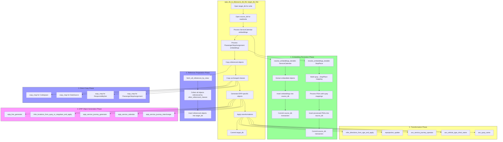
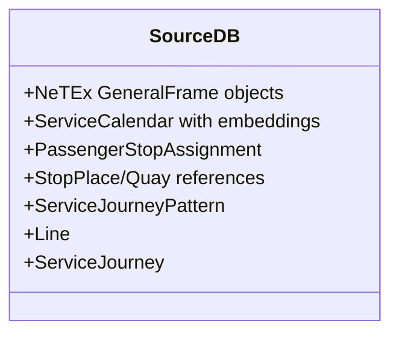
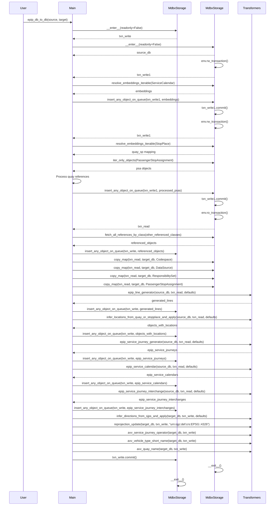
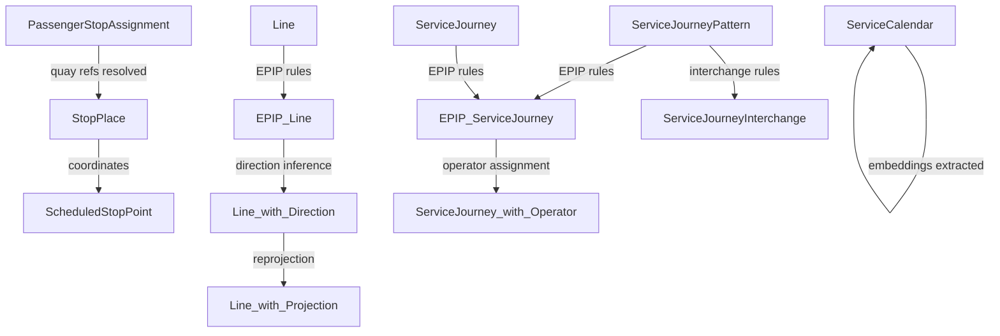

# Conversion Call Graph: conv.epip_db_to_db

## Overview

The `conv.epip_db_to_db` module transforms NeTEx data from a source MDBX database to a target MDBX database following the EPIP (European Passenger Information Profile) specifications. This document shows the call graph and how the software transforms different building blocks.

## Call Graph



## Building Block Transformations

### Input Building Blocks



### Transformation Pipeline

```mermaid
flowchart LR
    subgraph Input["Source DB Objects"]
        SC[ServiceCalendar]
        PSA[PassengerStopAssignment]
        SP[StopPlace]
        Q[Quay]
        Line[Line]
        SJ[ServiceJourney]
        SJP[ServiceJourneyPattern]
        SJI[ServiceJourneyInterchange]
    end

    subgraph Embedding["Embedding Extraction"]
        SC_E[ServiceCalendar
        (embeddings extracted)]
        PSA_E[PassengerStopAssignment
        (quay→StopPlace resolved)]
    end

    subgraph EPIP["EPIP Generation"]
        Line_E[Line
        (EPIP profile)]
        SJ_E[ServiceJourney
        (EPIP profile)]
        SC_E2[ServiceCalendar
        (EPIP profile)]
        SJI_E[ServiceJourneyInterchange
        (EPIP profile)]
    end

    subgraph Transform["Transformations"]
        Line_D[Line
        (directions inferred)]
        Loc[Located objects
        (reprojected)]
        SJ_O[ServiceJourney
        (operator assigned)]
    end

    subgraph Output["Target DB Objects"]
        All[Complete EPIP profile objects]
    end

    SC -->|extract embeddings| SC_E
    PSA -->|resolve quay refs| PSA_E
    Line -->|epip_line_generator| Line_E
    SJ -->|epip_service_journey_generator| SJ_E
    SC_E -->|epip_service_calendar| SC_E2
    SJP -->|epip_service_journey_interchange| SJI_E
    Line_E -->|infer_directions| Line_D
    Line_D -->|reprojection| Loc
    SJ_E -->|avv_service_journey_operator| SJ_O
    
    SC_E --> Target
    PSA_E --> Target
    Line_E --> Target
    SJ_E --> Target
    SC_E2 --> Target
    SJI_E --> Target
    Line_D --> Target
    Loc --> Target
    SJ_O --> Target
    
    Target[Target DB] --> Output
```

## Detailed Call Sequence



## Data Flow Diagram

```mermaid
flowchart TD
    subgraph SourceDB["Source Database"]
        S1[ServiceCalendar
        with embedded objects]
        S2[PassengerStopAssignment
        with quay references]
        S3[StopPlace/Quay
        objects]
        S4[Line objects]
        S5[ServiceJourneyPattern]
        S6[ServiceJourney]
        S7[Other referenced objects]
    end

    subgraph Processing["Processing Functions"]
        P1[resolve_embeddings_iterable
        Extract embedded ServiceCalendar objects]
        P2[resolve_embeddings_iterable
        Build quay→StopPlace mapping]
        P3[fetch_all_references_by_class
        Collect referenced objects]
        P4[copy_map
        Direct copy unchanged classes]
        P5[epip_line_generator
        Create EPIP-compliant Lines]
        P6[infer_locations
        Add coordinates from quay/stopplace]
        P7[epip_service_journey_generator
        Create EPIP ServiceJourneys]
        P8[epip_service_calendar
        Create EPIP ServiceCalendars]
        P9[epip_service_journey_interchange
        Create EPIP ServiceJourneyInterchanges]
        P10[infer_directions
        Infer direction from patterns]
        P11[reprojection
        Project to target CRS]
        P12[avv_* functions
        IVU-specific transformations]
    end

    subgraph TargetDB["Target Database"]
        T1[Referenced objects
        (from source)]
        T2[Copied classes
        (Codespace, DataSource, etc.)]
        T3[Generated EPIP Lines]
        T4[Objects with locations]
        T5[Generated EPIP ServiceJourneys]
        T6[Generated EPIP ServiceCalendars]
        T7[Generated EPIP ServiceJourneyInterchanges]
        T8[Lines with directions]
        T9[Reprojected objects]
        T10[IVU-enhanced objects]
    end

    S1 --> P1
    S3 --> P2
    S2 --> P2
    S7 --> P3
    S4 --> P5
    S3 --> P6
    S5 --> P7
    S6 --> P7
    S6 --> P8
    S5 --> P8
    S6 --> P9
    T3 --> P10
    T4 --> P11
    T5 --> P12

    P1 --> S1
    P2 --> T1
    P3 --> T1
    P4 --> T2
    P5 --> T3
    P6 --> T4
    P7 --> T5
    P8 --> T6
    P9 --> T7
    P10 --> T8
    P11 --> T9
    P12 --> T10
```

## Key Transformers Involved

| Transformer | Source | Purpose | Output |
|-------------|--------|---------|--------|
| `epip_line_generator` | `transformers.epip` | Create EPIP-compliant Line objects | EPIP Line objects |
| `infer_locations_from_quay_or_stopplace_and_apply` | `transformers.scheduledstoppoint` | Add coordinates from Quay/StopPlace | Objects with explicit locations |
| `epip_service_journey_generator` | `transformers.epip` | Generate EPIP ServiceJourneys from patterns | EPIP ServiceJourney objects |
| `epip_service_calendar` | `transformers.epip` | Create EPIP ServiceCalendars | EPIP ServiceCalendar objects |
| `epip_service_journey_interchange` | `transformers.epip` | Generate ServiceJourneyInterchanges | EPIP ServiceJourneyInterchange objects |
| `infer_directions_from_sjps_and_apply` | `transformers.direction` | Infer Direction from ServiceJourneyPatterns | Lines/ServiceJourneys with Direction |
| `reprojection_update` | `transformers.projection` | Reproject all locations to target CRS | Objects with reprojected coordinates |
| `avv_service_journey_operator` | `transformers.ivu` | Assign operators (IVU-specific) | ServiceJourneys with operators |
| `avv_vehicle_type_short_name` | `transformers.ivu` | Fix vehicle type names | VehicleTypes with short names |
| `avv_quay_name` | `transformers.ivu` | Fix quay names | Quays with proper names |

## Building Block Dependency Graph



## Performance Characteristics

| Phase | Database Access | CPU Intensive | Memory Usage | I/O Pattern |
|-------|-----------------|---------------|--------------|-------------|
| Embedding Resolution | Read/Write source | Medium | Medium | Sequential |
| Reference Collection | Read source | Low | Low | Random |
| Direct Copy | Read source, Write target | Low | Low | Sequential |
| EPIP Generation | Read source, Write target | High | High | Random |
| Transformations | Read/Write target | Medium | Medium | Random |

## Summary

The `conv.epip_db_to_db` call graph demonstrates a well-structured transformation pipeline that:

1. **Prepares** the source data by extracting embeddings and resolving references
2. **Copies** unchanged objects directly to the target
3. **Generates** EPIP-specific objects using profile transformers
4. **Applies** additional transformations (directions, projections, IVU-specific rules)

Each phase operates on specific building blocks, transforming them according to the EPIP profile requirements while maintaining the integrity of the NeTEx data model.