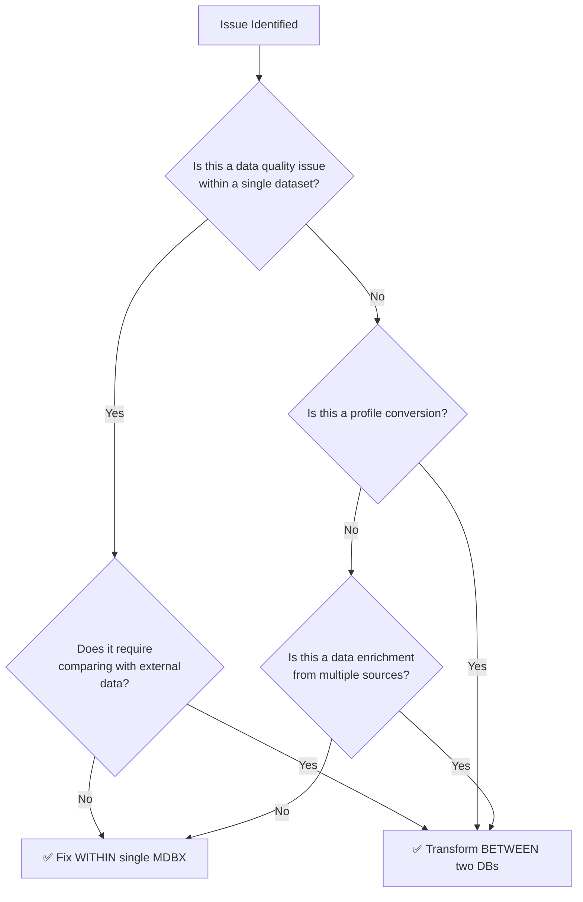
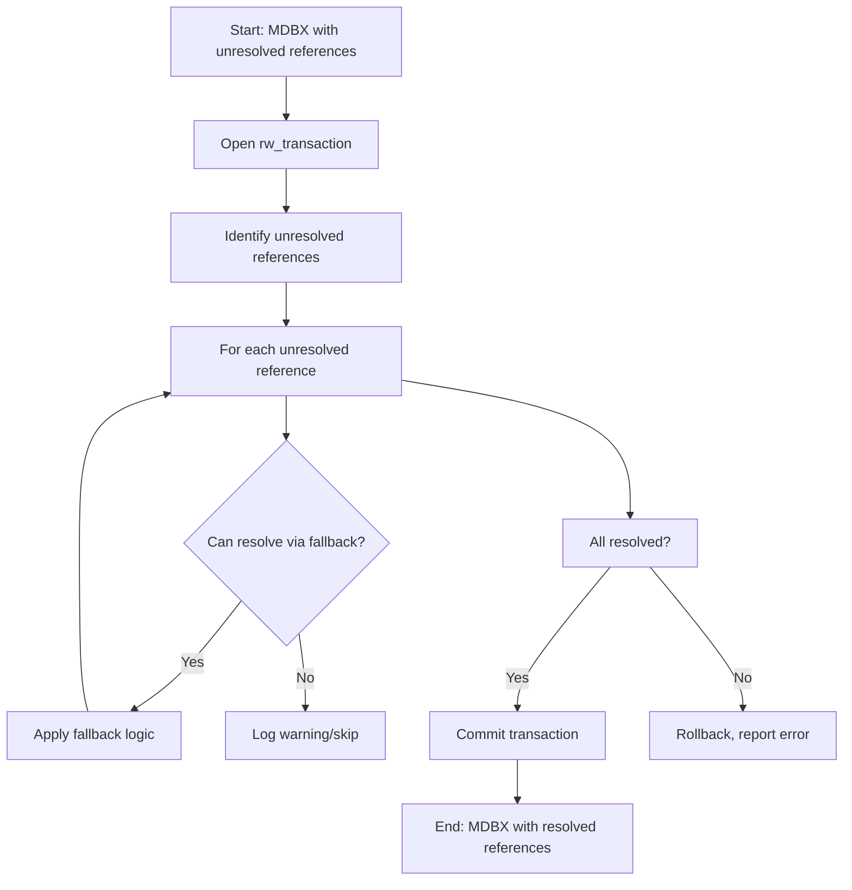
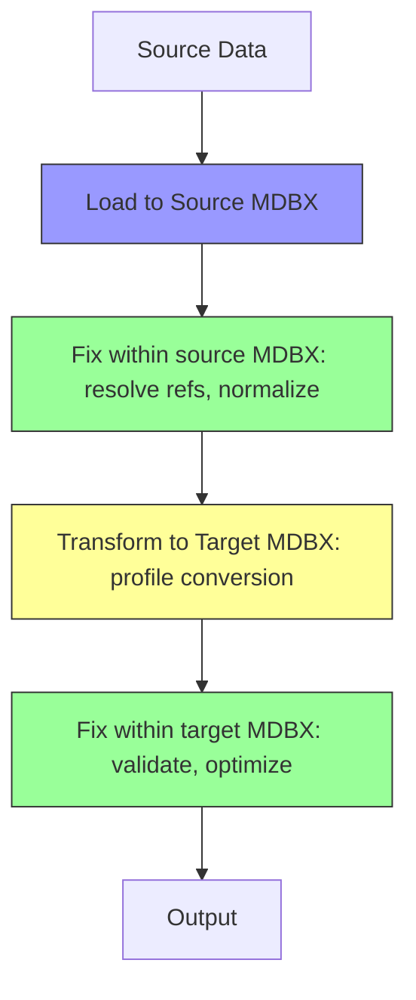

# When to Fix Within MDBX vs. Transform Between Two DBs

## Architecture-Level Decision Guide

This document provides guidance on when to fix issues **within a single MDBX database** versus when to use a **transformation step between two databases**. These are fundamental architectural decisions that affect performance, maintainability, and data integrity.

## Decision Framework



## Fix Within Single MDBX Database

### When to Use

Fix issues **within a single MDBX database** when:

#### ✅ Ideal Use Cases

1. **Reference Resolution Issues**
   - Missing or ambiguous reference targets
   - Version mismatches that can be auto-resolved
   - Class inference for untyped references
   - Circular reference detection and breaking

2. **Embedded Object Handling**
   - Extracting embedded objects to top-level
   - Resolving embedded object references
   - Flattening nested structures
   - De-duplicating embedded objects

3. **Data Normalization**
   - Default value population (codespaces, versions, etc.)
   - String formatting (ID normalization, whitespace cleanup)
   - Unit conversion (all distances to meters, all times to UTC)
   - Enum value standardization

4. **Schema Compliance**
   - Mandatory field population
   - Cardinality constraint enforcement
   - Type validation and coercion
   - Unique identifier enforcement

5. **Simple Data Cleaning**
   - Removing empty collections
   - Null value handling
   - Duplicate removal within single dataset
   - Outlier detection and correction

6. **Index Optimization**
   - Rebuilding indexes
   - Reference graph analysis
   - Statistics collection
   - Validation queries

#### ⚠️ Considerations

| Factor | Within MDBX | Notes |
|--------|-------------|-------|
| **Performance** | ⭐⭐⭐⭐ | Single transaction, minimal I/O |
| **Memory Usage** | ⭐⭐⭐ | All data in memory during transaction |
| **Atomicity** | ⭐⭐⭐⭐⭐ | Single transaction, all-or-nothing |
| **Debugging** | ⭐⭐⭐ | Can inspect database state before/after |
| **Flexibility** | ⭐⭐ | Limited to single dataset |
| **Reproducibility** | ⭐⭐⭐⭐⭐ | Deterministic within same input |

### Implementation Pattern

```python
# Pattern: Fix within single MDBX
with MdbxStorage(database, readonly=False) as storage:
    with storage.env.rw_transaction() as txn:
        # Read current state
        objects = storage.iter_objects(txn, SomeClass)
        
        # Apply fixes
        fixed_objects = [fix(obj) for obj in objects]
        
        # Write back to same database
        storage.insert_any_object_on_queue(txn, fixed_objects)
        
        # Commit - all changes atomic
        txn.commit()
```

### Example: Reference Resolution



## Transform Between Two DBs

### When to Use

Transform **between two databases** when:

#### ✅ Ideal Use Cases

1. **Profile Conversions**
   - NeTEx GeneralFrame → EPIP profile
   - Dutch profile → Nordic profile
   - GTFS → NeTEx conversion
   - Any format-to-format conversion

2. **Data Enrichment from External Sources**
   - Adding data from national stop registry
   - Merging multiple datasets (GTFS + NeTEx)
   - Incorporating reference data (codespaces, operators)
   - Adding geographic data from external sources

3. **Complex Data Transformations**
   - Inferring directions from ServiceJourneyPatterns
   - Generating ServiceCalendars from DayTypes
   - Creating ServiceJourneyInterchanges from patterns
   - Projecting coordinates to different CRS

4. **Data Filtering**
   - Extracting subset of data (by date, region, operator)
   - Removing sensitive data
   - Applying access control rules
   - Creating profile-specific views

5. **Multi-Stage Processing**
   - Intermediate results between processing steps
   - Checkpoint/savepoints for long-running operations
   - Separating source and target for validation
   - Parallel processing pipelines

6. **Data Migration**
   - Upgrading database schema
   - Migrating between storage backends
   - Version upgrades (NeTEx 1.x → 2.x)
   - Re-structuring data

#### ⚠️ Considerations

| Factor | Between Two DBs | Notes |
|--------|------------------|-------|
| **Performance** | ⭐⭐⭐ | Two databases open, more I/O |
| **Memory Usage** | ⭐⭐⭐⭐ | Can stream between databases |
| **Atomicity** | ⭐⭐ | Two separate transactions |
| **Debugging** | ⭐⭐⭐⭐ | Can inspect both source and target |
| **Flexibility** | ⭐⭐⭐⭐⭐ | Can use different schemas, indexes |
| **Reproducibility** | ⭐⭐⭐⭐ | Deterministic with same inputs |

### Implementation Pattern

```python
# Pattern: Transform between two DBs
with MdbxStorage(target_db, readonly=False) as target:
    with target.env.rw_transaction() as txn_write:
        with MdbxStorage(source_db, readonly=True) as source:
            with source.env.ro_transaction() as txn_read:
                # Read from source
                source_objects = source.iter_objects(txn_read, SourceClass)
                
                # Transform
                target_objects = transform(source_objects)
                
                # Write to target
                target.insert_any_object_on_queue(txn_write, target_objects)
                
                # Commit target
                txn_write.commit()
```

### Example: Profile Conversion

```mermaid
flowchart TD
    A[Start: Source MDBX (GeneralFrame)] --> B[Open source_db readonly]
    B --> C[Open target_db for write]
    C --> D[Open read transaction on source]
    D --> E[Open write transaction on target]
    E --> F[Copy unchanged classes directly]
    F --> G[Apply profile transformers]
    G --> H[Infer missing data]
    H --> I[Validate results]
    I --> J{Validation OK?}
    J -->|Yes| K[Commit target transaction]
    J -->|No| L[Rollback, report errors]
    K --> M[End: Target MDBX (EPIP profile)]
```

## Comparison Matrix

| Criteria | Fix Within MDBX | Transform Between DBs |
|----------|-----------------|----------------------|
| **Data Scope** | Single dataset | Single or multiple datasets |
| **External Data Access** | ❌ No | ✅ Yes |
| **Transaction Scope** | Single atomic operation | Separate source/target operations |
| **Memory Efficiency** | ⭐⭐⭐ (all in one DB) | ⭐⭐⭐⭐ (can stream) |
| **I/O Overhead** | ⭐⭐⭐⭐⭐ (minimal) | ⭐⭐ (two DBs) |
| **Code Complexity** | ⭐⭐⭐ (simpler) | ⭐⭐ (more complex) |
| **Error Recovery** | ⭐⭐⭐ (single transaction) | ⭐⭐⭐⭐ (can retry target) |
| **Parallel Processing** | ❌ Single writer | ✅ Possible (read-only source) |
| **Data Consistency** | ⭐⭐⭐⭐⭐ (atomic) | ⭐⭐⭐ (depends on implementation) |
| **Use Case Flexibility** | ⭐⭐ (limited) | ⭐⭐⭐⭐⭐ (broad) |

## Decision Table

### ✅ Fix WITHIN Single MDBX When...

| Scenario | Reason | Example |
|----------|--------|---------|
| Reference resolution | Only affects internal consistency | `resolve()` function |
| Embedded object extraction | Single dataset operation | `resolve_embeddings()` |
| Data normalization | Consistent within dataset | Default value population |
| Simple validation fixes | No external data needed | Mandatory field population |
| Index maintenance | Internal optimization | Reference index rebuilding |
| Duplicate removal | Within same dataset | Remove duplicate StopPlaces |
| Schema compliance | Self-contained | Type coercion |

### ✅ Transform BETWEEN Two DBs When...

| Scenario | Reason | Example |
|----------|--------|---------|
| Profile conversion | Different target schema | EPIP, Dutch, Nordic profiles |
| Format conversion | Different data model | GTFS → NeTEx |
| Data enrichment | External data sources | Add stop registry data |
| Complex inference | Requires cross-dataset analysis | Direction inference from patterns |
| Multi-source merge | Multiple input datasets | GTFS + NeTEx + external |
| Data filtering | Subset extraction | Regional extraction |
| Schema migration | Structural changes | NeTEx version upgrade |

## Hybrid Approach: Best of Both Worlds

Some operations benefit from a **hybrid approach**:

1. **Pre-fix within source DB** (clean, normalize, resolve)
2. **Transform between DBs** (profile conversion, enrichment)
3. **Post-fix within target DB** (final validation, optimization)



### Example: Complete EPIP Conversion Pipeline

```python
# Step 1: Load and fix within source
with MdbxStorage(source_db, readonly=False) as storage:
    # Load NeTEx XML
    insert_database(storage, interesting_classes, xml_file)
    
    # Fix within source: resolve references and embeddings
    resolve(storage)
    resolve_embeddings(storage)
    
    # Additional fixes within source
    normalize_defaults(storage)

# Step 2: Transform between DBs
with MdbxStorage(target_db, readonly=False) as target:
    with target.env.rw_transaction() as txn_write:
        with MdbxStorage(source_db, readonly=True) as source:
            with source.env.ro_transaction() as txn_read:
                # Copy referenced objects
                target.insert_any_object_on_queue(
                    txn_write, 
                    source.fetch_all_references_by_class(txn_read, other_referenced_classes)
                )
                
                # Transform: EPIP profile conversion
                target.insert_any_object_on_queue(
                    txn_write, 
                    epip_line_generator(source, txn_read, defaults)
                )
                target.insert_any_object_on_queue(
                    txn_write, 
                    epip_service_journey_generator(source, txn_read, defaults)
                )
                
                # Additional transformations
                infer_directions_from_sjps_and_apply(target, txn_write, defaults)
                reprojection_update(target, txn_write, target_crs)
                
                txn_write.commit()
```

## Anti-Patterns to Avoid

### ❌ Don't: Fix in XML Output Stage

**Problem**: Applying fixes after XML generation
- Breaks audit trail
- Requires re-parsing
- Extremely inefficient
- Hard to maintain

**Instead**: Always fix data in MDBX stages

### ❌ Don't: Transform Without Clear Separation

**Problem**: Mixing source and target operations in same transaction
- Hard to debug
- Risk of corruption
- Poor performance
- Not reproducible

**Instead**: Use separate read-only source and read-write target transactions

### ❌ Don't: Fix External Data Issues Within Single DB

**Problem**: Trying to fix issues that require external data
- Missing reference targets from other datasets
- Data inconsistencies between sources
- Cross-dataset validation

**Instead**: Use two-DB transform with external data as additional source

## Performance Guidelines

### When Performance Matters

| Operation Type | Best Approach | Performance |
|---------------|---------------|-------------|
| Simple data cleaning | Within MDBX | ⭐⭐⭐⭐⭐ |
| Reference resolution | Within MDBX | ⭐⭐⭐⭐⭐ |
| Profile conversion | Between DBs | ⭐⭐⭐⭐ |
| Data enrichment | Between DBs | ⭐⭐⭐⭐ |
| Complex inference | Between DBs | ⭐⭐⭐⭐ |
| Large dataset processing | Between DBs (streaming) | ⭐⭐⭐⭐⭐ |

### Memory Considerations

| Approach | Memory Usage | Scalability |
|----------|--------------|-------------|
| Within MDBX (single transaction) | High (all data in memory) | ⭐⭐ (limited by transaction size) |
| Within MDBX (chunked) | Medium (chunk size controlled) | ⭐⭐⭐⭐ |
| Between DBs (streaming) | Low (stream between DBs) | ⭐⭐⭐⭐⭐ |
| Between DBs (batched) | Medium (batch size controlled) | ⭐⭐⭐⭐ |

## Real-World Examples from Badger

### ✅ Fix Within MDBX: `netex_to_db.py`

```python
# Load NeTEx and fix within single DB
def netex_to_db(filenames: set[Path], database: Path) -> None:
    with MdbxStorage(database, readonly=False) as storage:
        # Insert all objects
        for filename in filenames:
            xml_storage = XmlStorage(filename)
            for sub_file, real_filename in xml_storage.open_netex_file():
                insert_database(storage, interesting_classes, sub_file)
        
        # Fix within: resolve all references
        resolve(storage)  # <-- Fix within single MDBX
        resolve_embeddings(storage)  # <-- Fix within single MDBX
```

**Why within?** Single dataset, reference resolution is internal operation, atomic transaction desired.

### ✅ Transform Between DBs: `epip_db_to_db.py`

```python
def epip_db_to_db(source_database_file: Path, target_database_file: Path) -> None:
    with MdbxStorage(target_database_file, readonly=False) as target_db:
        with target_db.env.rw_transaction() as txn_write:
            with MdbxStorage(source_database_file, readonly=False) as source_db:
                # ... processing ...
                
                # Transform: copy and convert
                target_db.insert_any_object_on_queue(
                    txn_write, 
                    epip_line_generator(source_db, txn_read, generator_defaults)
                )  # <-- Transform between DBs
                
                # Transform: apply profile rules
                infer_directions_from_sjps_and_apply(target_db, txn_write, generator_defaults)
```

**Why between?** Profile conversion (GeneralFrame → EPIP), requires source data for reference, produces different target schema.

## Summary: Decision Checklist

Ask these questions to decide:

1. **Does this operation only affect a single dataset?**
   - ✅ Yes → Fix within MDBX
   - ❌ No → Transform between DBs

2. **Does this require data from external sources?**
   - ✅ Yes → Transform between DBs
   - ❌ No → Fix within MDBX

3. **Is this a profile/format conversion?**
   - ✅ Yes → Transform between DBs
   - ❌ No → Fix within MDBX

4. **Does this require atomic all-or-nothing semantics?**
   - ✅ Yes → Fix within MDBX
   - ❌ No → Transform between DBs (or use two-phase commit)

5. **Is performance critical for large datasets?**
   - ✅ Yes → Transform between DBs (streaming)
   - ❌ No → Fix within MDBX (simpler)

6. **Do I need to preserve the source data unchanged?**
   - ✅ Yes → Transform between DBs
   - ❌ No → Fix within MDBX

**General Rule**: When in doubt, prefer **transform between two DBs** for flexibility, but use **fix within MDBX** for simple, atomic operations on a single dataset.
