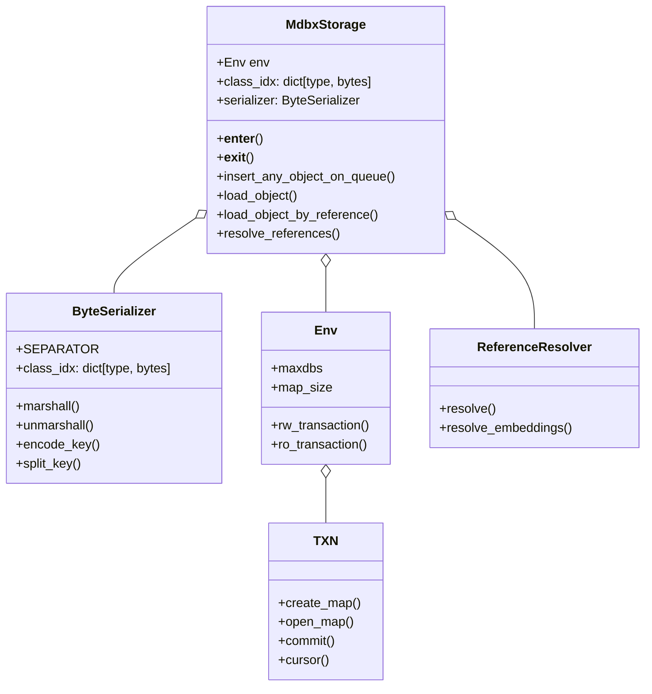
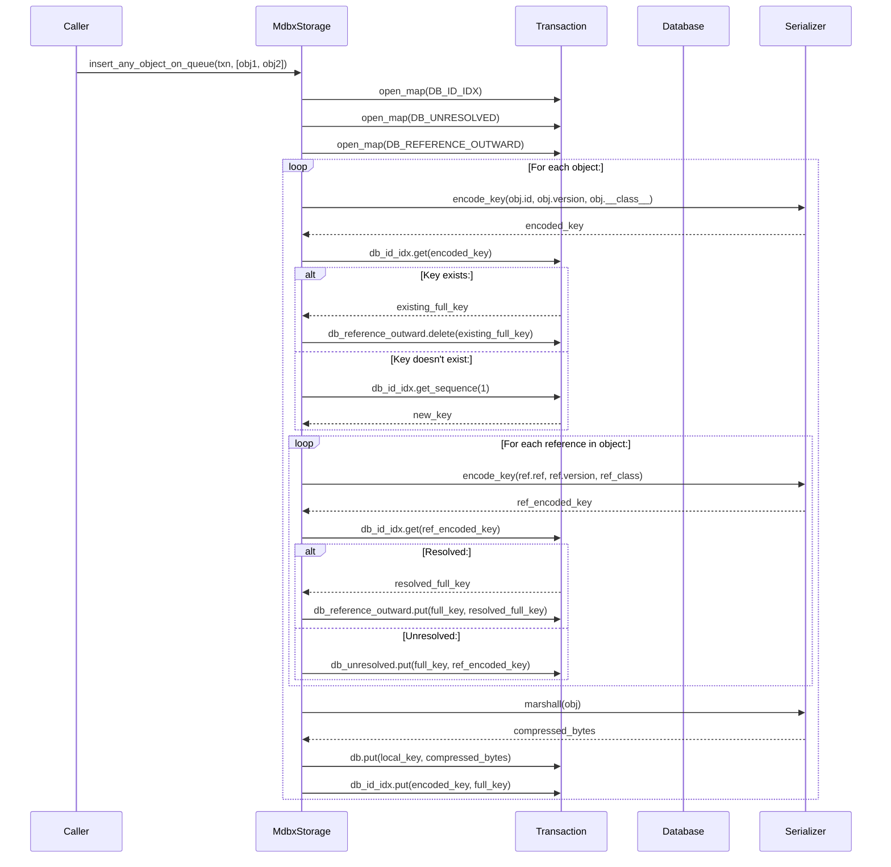
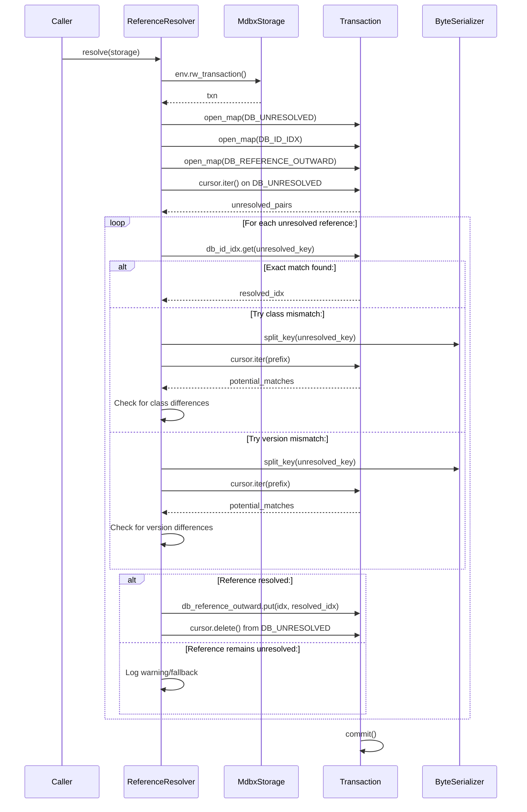
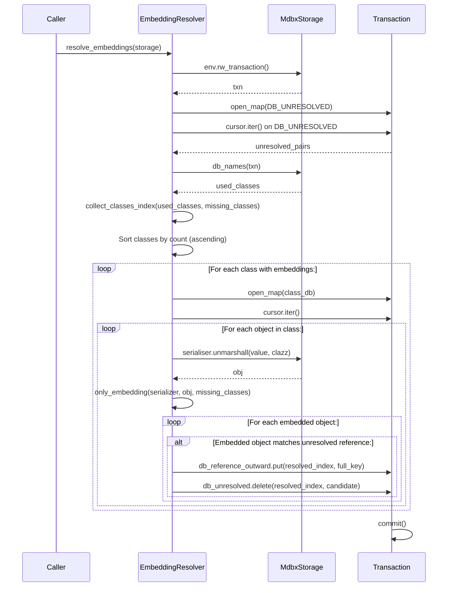
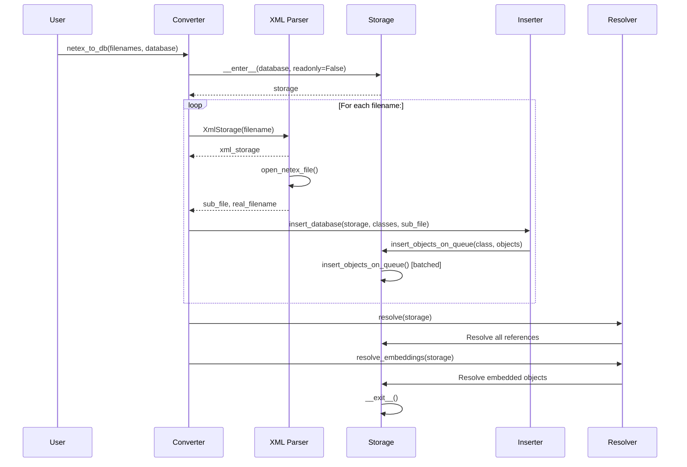
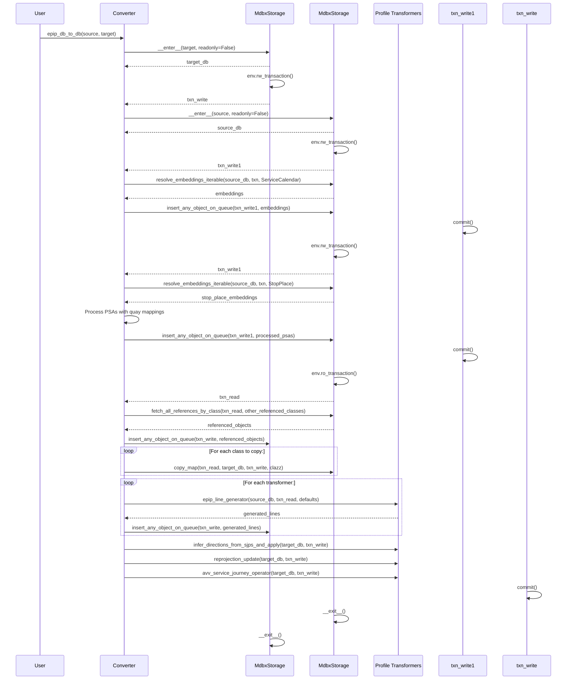

did yo# MDBX Usage Analysis in Badger

## Table of Contents

1. [Overview](#overview)
2. [MDBX Architecture in Badger](#mdbx-architecture-in-badger)
3. [Sequence Diagrams](#sequence-diagrams)
4. [Reference Handling Analysis](#reference-handling-analysis)
5. [Shortcomings and Issues](#shortcomings-and-issues)
6. [Recommendations](#recommendations)
7. [Conclusion](#conclusion)

---

## Overview

**MDBX (Memory-Mapped Database eXtra)** is the primary storage backend used in Badger for persisting NeTEx objects during the conversion pipeline. It serves as a high-performance key-value store that enables efficient streaming processing of large timetable datasets.

### Key Characteristics of MDBX Usage

- **Embedded Database**: Zero-configuration, embedded key-value store
- **Memory-Mapped**: Uses memory-mapping for fast access
- **ACID Compliant**: Supports transactions with atomicity guarantees
- **Multi-Database**: Single environment can contain multiple named databases
- **B+Tree Indexing**: Efficient range queries and sorted iteration

---

## MDBX Architecture in Badger

### Core Components



### Database Schema

Badger uses a multi-database approach within a single MDBX environment:

```
┌─────────────────────────────────────────────────────────────┐
│                    MDBX Environment                           │
├─────────────────────────────────────────────────────────────┤
│  DB_CLASS_IDX         - Class to index mapping               │
│  DB_ID_IDX            - ID to full key lookup                 │
│  DB_UNRESOLVED       - Unresolved reference tracking        │
│  DB_REFERENCE_OUTWARD - Outward reference relationships       │
│  <class_idx_1>        - Entity database (e.g., Line)         │
│  <class_idx_2>        - Entity database (e.g., StopPlace)    │
│  ...                 - Additional per-class databases        │
└─────────────────────────────────────────────────────────────┘
```

### Key Encoding Strategy

The `ByteSerializer` implements a sophisticated key encoding system:

1. **String Encoding**: Converts strings to uppercase with special character replacement
2. **Key Format**: `ID\0VERSION\0CLASS_IDX` (using `\0` as separator)
3. **Full Key**: Combines class index (2 bytes) and local key (4 bytes) into 8-byte composite key
4. **Value Storage**: Uses CloudPickle + LZ4 compression for object serialization

```python
# Example key encoding
key = ByteSerializer.encode_key(
    id="NL:SA:12345",
    version="1.0",
    clazz=ScheduledStopPoint,
    include_clazz=True
)
# Result: b'NL-SA-12345\x001.0\x00<2_byte_class_idx>'
```

---

## Sequence Diagrams

### 1. Object Insertion with Reference Tracking



### 2. Reference Resolution Process



### 3. Embedded Object Resolution



### 4. NeTEx XML to MDBX Import (netex_to_db.py)



### 5. EPIP Profile Transformation (epip_db_to_db.py)



---

## Reference Handling Analysis

### Reference Types in NeTEx

NeTEx defines several reference types that Badger handles:

1. **VersionOfObjectRefStructure**: Primary reference type with `ref`, `version`, and `name_of_ref_class`
2. **VersionOfObjectRef**: Simplified reference without explicit class name
3. **CodespaceRefStructure**: Reference to codespace definitions
4. **DataSourceRefStructure**: Reference to data source information
5. **Embedded Objects**: Objects contained directly within parent objects

### Reference Handling Pipeline

```mermaid
flowchart TD
    subgraph Input["Input Processing"]
        A[NeTEx XML/GTFS] --> B[Parse to Objects]
    end
    
    subgraph Extraction["Reference Extraction"]
        B --> C[only_references() - Extract all refs]
        C --> D[Encode reference keys]
    end
    
    subgraph Storage["Storage Phase"]
        D --> E[Store in DB_UNRESOLVED if target missing]
        D --> F[Store in DB_REFERENCE_OUTWARD if resolved]
        E --> G[DB_UNRESOLVED: {source_key: target_key}]
        F --> H[DB_REFERENCE_OUTWARD: {source_key: [target_keys]}]
    end
    
    subgraph Resolution["Resolution Phase"]
        G --> I[resolve() - Try to resolve all]
        I --> J[Check exact match]
        J --> K[Check class mismatch]
        K --> L[Check version mismatch]
        L --> M[Update reference in source object]
        
        H --> N[resolve_embeddings() - Handle embedded objects]
        N --> O[Extract embedded objects]
        O --> P[Create top-level references]
        P --> Q[Remove from DB_UNRESOLVED]
    end
    
    subgraph Output["Output"]
        M --> R[Resolved object graph]
        Q --> R
        R --> S[Serialization/Export]
    end
```

### Reference Resolution Strategies

#### 1. Exact Match Resolution
```python
# Most common case - exact ID, version, and class match
resolved_idx = db_id_idx.get(txn, encoded_reference_key)
if resolved_idx:
    # Reference is resolved
    db_reference_outward.put(txn, source_key, resolved_idx)
```

#### 2. Class Mismatch Resolution
When the ID and version match but the class differs:
```python
# Try with class removed from key
parts = storage.serializer.split_key(value)
parts.pop()  # Remove class
prefix = separator.join(parts)
for check_key, check_idx in cursor.iter(prefix):
    if check_key.startswith(prefix):
        # Found match with different class
        # Update reference's name_of_ref_class
```

#### 3. Version Mismatch Resolution
When the ID matches but version differs:
```python
# Try with version removed from key
parts.pop()  # Remove version
prefix = separator.join(parts)
for check_key, check_idx in cursor.iter(prefix):
    if check_key.startswith(prefix):
        # Found match with different version
        # Update reference's version
```

#### 4. Embedded Object Resolution
Handles objects that are embedded within parent objects:
```python
# Extract embedded objects from parent
for obj, path in recursive_attributes(parent_obj, []):
    if hasattr(obj, "id") and obj.id is not None:
        if obj.__class__ in interesting_classes:
            yield serializer.encode_key(obj.id, obj.version, obj.__class__, include_clazz=True)
```

### Reference Lookup Patterns

#### Direct Lookup by Reference
```python
def load_object_by_reference(txn, ref: VersionOfObjectRefStructure):
    # Optimal path: use name_of_ref_class
    if ref.name_of_ref_class is not None:
        key = serializer.encode_key(
            str(ref.ref), 
            ref.version, 
            serializer.name_object[ref.name_of_ref_class],
            include_clazz=True
        )
        full_key = db_id_idx.get(txn, key)
        return load_object_by_full_key(txn, full_key)
```

#### Inward Reference Traversal
```python
def load_references_by_object_values_dfs(txn, full_key, inward_classes):
    # Deep traversal of reference graph
    stack = [full_key]
    visited = set()
    
    while stack:
        identifier = stack.pop()
        if identifier not in visited:
            visited.add(identifier)
            obj = load_object_by_full_key(txn, identifier)
            yield obj
            
            # Follow references outward
            for ref_key in load_references_by_clazz_full_key(txn, identifier, False):
                stack.append(ref_key)
```

---

## Shortcomings and Issues

### 1. Reference Resolution Performance

#### Issue: Inefficient Reference Lookups

**Problem**: The current `resolve()` function performs individual database lookups for each unresolved reference, leading to O(n) database operations for n unresolved references.

**Evidence**:
```python
# In references.py:resolve()
for idx, value in unresolved_cursor.iter():
    resolved_idx = db_id_idx.get(txn, value)  # Individual lookup
    if not resolved_idx:
        # Fallback to prefix search - even slower
        cursor = txn.cursor(db=db_id_idx)
        parts = storage.serializer.split_key(value)
        parts.pop()
        prefix = separator.join(parts)
        for check_key, check_idx in cursor.iter(prefix):  # Multiple lookups
            ...
```

**Impact**: 
- Poor scalability with large datasets
- Each reference resolution requires multiple database cursor iterations
- No caching of resolved references within a transaction

#### Issue: No Batch Reference Resolution

**Problem**: References are resolved one at a time rather than in batches.

**Evidence**: The system processes each unresolved reference individually without leveraging batch operations.

**Impact**: 
- High overhead for large numbers of references
- Missed optimization opportunities for sequential access patterns
- Inefficient use of MDBX cursor capabilities

### 2. Memory Management Issues

#### Issue: Transaction Memory Accumulation

**Problem**: Large transactions accumulate all changes in memory until commit, which can cause memory pressure.

**Evidence**:
```python
# In epip_db_to_db.py
with source_db.env.rw_transaction() as txn_write1:
    # Many objects inserted before commit
    source_db.insert_any_object_on_queue(txn_write1, all_embeddings())
    # All objects held in transaction memory
```

**Impact**: 
- Memory usage grows linearly with transaction size
- Risk of out-of-memory errors on large datasets
- Long-running transactions block other operations

#### Issue: No Chunked Processing for Large Datasets

**Problem**: The system processes entire datasets in single passes without chunking.

**Evidence**:
```python
# In implementation.py
for obj in objects:  # processes all objects at once
    # ... insert logic
```

**Impact**:
- High peak memory usage
- No progress tracking for long operations
- Cannot resume from checkpoints on failure

### 3. Reference Handling Problems

#### Issue: Complex Reference Matching Logic

**Problem**: The fallback reference matching logic (class mismatch, version mismatch) is complex and potentially error-prone.

**Evidence**:
```python
# In references.py:resolve()
if not resolved_idx:
    cursor = txn.cursor(db=db_id_idx)
    parts = storage.serializer.split_key(value)
    
    # Alternative 1: class mismatch
    parts.pop()
    prefix = separator.join(parts)
    for check_key, check_idx in cursor.iter(prefix):
        if check_key.startswith(prefix):
            class_change = check_idx
            resolved_idx = check_idx
        break

    if not resolved_idx:
        # Alternative 2: version mismatch
        parts.pop()
        prefix = separator.join(parts)
        for check_key, check_idx in cursor.iter(prefix):
            if check_key.startswith(prefix):
                version_change = check_idx
                resolved_idx = check_idx
            break
```

**Impact**:
- Difficult to maintain and debug
- Inconsistent behavior across different reference types
- Potential for incorrect reference resolution
- Performance overhead from multiple fallback strategies

#### Issue: Incomplete Embedded Object Handling

**Problem**: The embedded object resolution (`resolve_embeddings`) has limitations and TODOs indicating incomplete implementation.

**Evidence**:
```python
# In references.py:resolve_embeddings()
# TODO: we are still missing the objects that are referenced from the reference

# In resolve_embeddings_iterable()
# TODO: Hier deduplicatie implementeren, dat zou veel dubbele objecten schelen
# (Translation: "implement deduplication here, that would save many duplicate objects")
```

**Impact**:
- Embedded objects may not be properly resolved in all cases
- Duplicate object creation possible
- Incomplete reference graph construction

### 4. Storage Design Issues

#### Issue: Redundant Index Structures

**Problem**: Multiple index databases store overlapping information, leading to redundancy and consistency concerns.

**Evidence**:
- `DB_ID_IDX`: Maps encoded keys to full keys
- `DB_REFERENCE_OUTWARD`: Maps source keys to referenced keys
- `DB_CLASS_IDX`: Maps class indices to class names

**Impact**:
- Storage overhead from redundant data
- Complexity in maintaining consistency
- Potential for index corruption if updates are incomplete

#### Issue: No Secondary Indexes

**Problem**: The system lacks secondary indexes for efficient querying by non-primary key attributes.

**Evidence**:
```python
# To find objects by attributes other than ID, must scan entire database
# In implementation.py:fetch_all_references_by_class()
db_reference_outward = txn.open_map(DB_REFERENCE_OUTWARD)
cursor = txn.cursor(db_reference_outward)
for it in cursor.iter_dupsort_rows():  # Full scan
    ...
```

**Impact**:
- Inefficient queries for non-ID lookups
- Full database scans required for many operations
- Poor performance for complex queries

### 5. Transaction Management Issues

#### Issue: Long-Running Transactions

**Problem**: Entire conversion operations are performed within single transactions.

**Evidence**:
```python
# In epip_db_to_db.py
with source_db.env.ro_transaction() as txn_read:
    # All processing happens here
    target_db.insert_any_object_on_queue(txn_write, source_db.fetch_all_references_by_class(...))
    # ... many more operations
    # Transaction stays open until very end
```

**Impact**:
- Database locked for extended periods
- Memory usage grows throughout transaction
- No progress checkpoints
- Failure requires restarting entire operation

#### Issue: No Transaction Batch Processing

**Problem**: Large operations are not broken into smaller transaction batches.

**Evidence**: The system does not implement any batching of database operations.

**Impact**:
- High memory usage for large datasets
- Long transaction commit times
- Increased risk of transaction timeout

### 6. Error Handling and Recovery

#### Issue: Inconsistent Error Handling

**Problem**: Error handling varies across different parts of the codebase.

**Evidence**:
```python
# In implementation.py:insert_objects_on_queue()
try:
    db_reference_outward.delete(txn, full_key)
except:
    pass  # Silent failure!
```

**Impact**:
- Silent failures can corrupt data
- Difficult to diagnose issues
- Inconsistent behavior on errors

#### Issue: No Rollback Mechanism

**Problem**: Partial failures may leave the database in an inconsistent state.

**Evidence**: No comprehensive rollback or compensation logic exists.

**Impact**:
- Inconsistent database state on failures
- Manual intervention required for recovery
- Difficult to ensure data integrity

### 7. Reference Integrity Issues

#### Issue: Reference Update Inconsistency

**Problem**: When references are updated (e.g., class or version mismatch), the source object is modified but this may not be propagated correctly.

**Evidence**:
```python
# In references.py:resolve()
if version_change or class_change:
    # Modify the referencing object
    db = txn.open_map(referencing_class_idx, flags=...)
    db.put(txn, referencing_key, storage.serializer.marshall(referencing_obj, referencing_obj.__class__))
    
    # But: what about cached/loaded versions of this object?
    # They will have stale references
```

**Impact**:
- Reference inconsistencies possible
- Cached objects may have stale references
- Difficult to ensure all references are updated consistently

### 8. NeTEx-Specific Reference Challenges

#### Issue: Complex NeTEx Reference Semantics

**Problem**: NeTEx has complex reference semantics that are not fully handled.

**Evidence**:
- Versioned vs. non-versioned references
- Class-specific reference structures
- External vs. internal references
- Frame-specific reference scoping

**Impact**:
- Some reference types may not be properly resolved
- Version handling is incomplete
- External references require special handling

#### Issue: Circular Reference Handling

**Problem**: Circular references in NeTEx data can cause infinite loops or incorrect processing.

**Evidence**: NeTEx allows circular references (e.g., A references B, B references A).

**Impact**:
- Potential for infinite loops in reference traversal
- Memory exhaustion from recursive resolution
- Incorrect handling of circular dependencies

### 9. Performance Bottlenecks

#### Issue: Serial Processing

**Problem**: Most processing is inherently serial, with limited parallelization.

**Evidence**: MDBX single-writer limitation forces serial writes.

**Impact**:
- Limited utilization of multi-core systems
- Long processing times for large datasets
- Poor scalability

#### Issue: Deserialization Overhead

**Problem**: Frequent object deserialization for reference resolution.

**Evidence**:
```python
# In references.py:resolve()
referenced_clazz = storage.idx_class[referenced_class_idx]
referenced_obj: Tid = storage.load_object(txn, referenced_clazz, referenced_key)
# This deserializes the entire object just to update one reference
```

**Impact**:
- High CPU usage from repeated deserialization
- Memory pressure from loaded objects
- Performance degradation with large object graphs

---

## Recommendations

### High Priority

#### 1. Implement Reference Caching

**Action**: Add an in-memory cache for resolved references within transactions.

```python
class ReferenceCache:
    def __init__(self):
        self.resolved: dict[bytes, bytes] = {}  # encoded_key -> full_key
        self.objects: dict[bytes, EntityStructure] = {}  # full_key -> object
    
    def get_resolved(self, encoded_key: bytes) -> Optional[bytes]:
        return self.resolved.get(encoded_key)
    
    def get_object(self, full_key: bytes) -> Optional[EntityStructure]:
        return self.objects.get(full_key)
```

**Benefits**:
- Eliminate redundant database lookups
- Reduce transaction memory overhead
- Improve reference resolution performance

#### 2. Add Transaction Batching

**Action**: Break large operations into configurable batches.

```python
def process_in_batches(objects: Iterable[Tid], batch_size: int = 10000):
    batch = []
    for obj in objects:
        batch.append(obj)
        if len(batch) >= batch_size:
            yield batch
            batch = []
    if batch:
        yield batch
```

**Benefits**:
- Control memory usage
- Provide progress tracking
- Enable checkpoint/restart capability
- Reduce transaction lock duration

#### 3. Improve Error Handling Framework

**Action**: Implement consistent error handling with proper logging and recovery.

```python
class StorageError(Exception):
    """Base class for storage errors"""
    pass

class ReferenceResolutionError(StorageError):
    """Error during reference resolution"""
    pass

def with_error_handling(func):
    @functools.wraps(func)
    def wrapper(*args, **kwargs):
        try:
            return func(*args, **kwargs)
        except Exception as e:
            logger.error(f"Error in {func.__name__}: {e}")
            raise StorageError(f"Failed in {func.__name__}") from e
    return wrapper
```

**Benefits**:
- Consistent error handling
- Better error messages
- Easier debugging
- Proper error propagation

### Medium Priority

#### 4. Optimize Reference Resolution

**Action**: Implement batch reference resolution with efficient lookups.

```python
def batch_resolve_references(storage: MdbxStorage, unresolved_pairs: dict[bytes, set[bytes]]):
    """Resolve references in batches for better performance"""
    
    # Group unresolved references by target class/prefix
    by_prefix: dict[bytes, list[tuple[bytes, bytes]]] = {}
    for idx, value in unresolved_pairs.items():
        prefix = get_prefix_for_lookup(value)
        by_prefix.setdefault(prefix, []).append((idx, value))
    
    # Process each prefix group efficiently
    for prefix, pairs in by_prefix.items():
        # Single cursor iteration for all references with same prefix
        cursor = txn.cursor(db=DB_ID_IDX)
        for check_key, check_idx in cursor.iter(prefix):
            # Find all unresolved references matching this key
            matching = [ (idx, val) for idx, val in pairs if val == check_key ]
            for idx, _ in matching:
                # Update all matching references at once
                db_reference_outward.put(txn, idx, check_idx)
                db_unresolved.delete(txn, idx, check_key)
```

**Benefits**:
- Reduce database cursor operations
- Better cache locality
- Improved performance for similar references

#### 5. Implement Proper Chunking for Large Datasets

**Action**: Add configurable chunking to all major processing operations.

```python
def process_large_dataset(dataset: Iterable[Tid], process_func, chunk_size: int = 10000):
    """Process large datasets in chunks"""
    chunk = []
    for item in dataset:
        chunk.append(item)
        if len(chunk) >= chunk_size:
            process_func(chunk)
            chunk = []
            # Optionally: commit transaction, clear cache, log progress
    if chunk:
        process_func(chunk)
```

**Benefits**:
- Controlled memory usage
- Progress tracking
- Checkpoint capability
- Better resource management

#### 6. Add Reference Integrity Validation

**Action**: Implement validation to ensure reference consistency.

```python
def validate_references(storage: MdbxStorage, txn: TXN) -> list[str]:
    """Validate all references in the database"""
    errors = []
    
    # Check for unresolved references
    db_unresolved = txn.open_map(DB_UNRESOLVED)
    cursor = txn.cursor(db_unresolved)
    for idx, value in cursor.iter():
        errors.append(f"Unresolved reference from {idx} to {value}")
    
    # Check for broken references
    db_reference_outward = txn.open_map(DB_REFERENCE_OUTWARD)
    cursor = txn.cursor(db_reference_outward)
    for source_key, target_key in cursor.iter():
        # Verify target exists
        if not verify_key_exists(txn, target_key):
            errors.append(f"Broken reference from {source_key} to non-existent {target_key}")
    
    return errors
```

**Benefits**:
- Catch reference issues early
- Ensure data integrity
- Provide debugging information
- Validate conversion results

### Low Priority

#### 7. Add Secondary Index Support

**Action**: Implement automatic secondary indexing for frequently queried attributes.

```python
class SecondaryIndex:
    def __init__(self, storage: MdbxStorage, attribute_name: str):
        self.storage = storage
        self.attribute_name = attribute_name
        self.index_db = f"_idx_{attribute_name}"
    
    def build_index(self, txn: TXN, clazz: type[Tid]):
        """Build index for a specific class and attribute"""
        db_main = txn.open_map(storage.class_idx[clazz])
        db_index = txn.create_map(name=self.index_db)
        
        for key, value in db_main.cursor().iter():
            obj = storage.serializer.unmarshall(value, clazz)
            attr_value = getattr(obj, self.attribute_name, None)
            if attr_value is not None:
                index_key = self.encode_index_key(attr_value)
                db_index.put(txn, index_key, key)
```

**Benefits**:
- Faster queries by non-ID attributes
- Better performance for complex lookups
- Enable efficient range queries

#### 8. Implement Checkpoint/Resume Capability

**Action**: Add ability to save progress and resume from checkpoints.

```python
class CheckpointManager:
    def __init__(self, checkpoint_file: Path):
        self.checkpoint_file = checkpoint_file
    
    def save_checkpoint(self, processed_count: int, current_state: dict):
        """Save current processing state"""
        checkpoint = {
            'timestamp': datetime.now().isoformat(),
            'processed_count': processed_count,
            'state': current_state
        }
        with open(self.checkpoint_file, 'w') as f:
            json.dump(checkpoint, f)
    
    def load_checkpoint(self) -> Optional[dict]:
        """Load last saved checkpoint"""
        if self.checkpoint_file.exists():
            with open(self.checkpoint_file, 'r') as f:
                return json.load(f)
        return None
```

**Benefits**:
- Resume from failures
- Continue interrupted operations
- Progress persistence
- Better user experience for long operations

---

## Conclusion

The MDBX storage implementation in Badger provides a solid foundation for NeTEx data processing with efficient key-value storage and transaction support. The architecture correctly handles the complex reference structures inherent in NeTEx data, with mechanisms for resolving both direct references and embedded objects.

### Key Strengths

1. **Efficient Storage**: CloudPickle + LZ4 compression provides good space efficiency
2. **Reference Tracking**: Comprehensive system for tracking and resolving references
3. **Transaction Support**: ACID-compliant transactions ensure data consistency
4. **Memory Mapping**: Leverages MDBX memory-mapping for fast access
5. **NeTEx Awareness**: Designed specifically for NeTEx object structures

### Critical Issues

1. **Performance**: Reference resolution and lookups are not optimized for large datasets
2. **Memory Management**: Lack of chunking and batching leads to high memory usage
3. **Error Handling**: Inconsistent and incomplete error handling
4. **Reference Integrity**: Complex fallback logic may lead to inconsistencies
5. **Scalability**: Serial processing limits scalability

### Overall Assessment

The current MDBX implementation **works correctly for moderate-sized datasets** but has **significant scalability and performance limitations** for large national timetables. The reference handling system is **conceptually sound** but **needs optimization** for production use with large datasets.

The most critical areas for improvement are:
1. Reference resolution performance (highest impact)
2. Memory management through batching/chunking
3. Consistent error handling
4. Reference caching

Implementing the high-priority recommendations would significantly improve Badger's ability to handle large NeTEx datasets while maintaining the current architecture's benefits of data integrity and NeTEx compliance.
