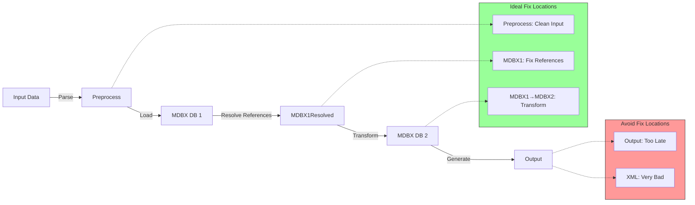
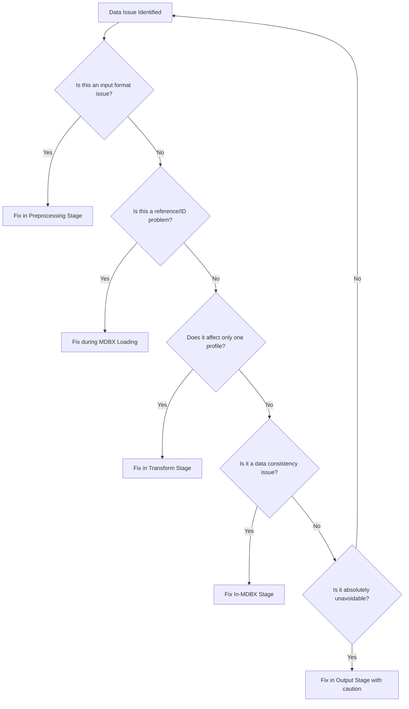

# Pipeline Architecture Diagram

## Overview

The Badger pipeline processes timetable data through multiple stages where changes can be applied at different points. Below is the architecture showing where modifications can be made most effectively.

## Architecture Diagram

```mermaid
flowchart TD
    subgraph Input["Input Sources"]
        A[NeTEx XML Files]
        B[GTFS ZIP Files]
        C[Other Formats]
    end

    subgraph Preprocessing["1. Join/Preprocessing Stage"]
        D[conv.netex_to_db.py]
        E[conv.gtfs_import_to_db.py]
        F[Data Cleaning]
        G[Initial Validation]
    end

    subgraph MDBXLoading["2. MDBX Loading Stage"]
        H[storage.mdbx.core.implementation.MdbxStorage]
        I[ByteSerializer: CloudPickle + LZ4]
        J[Reference Indexing]
    end

    subgraph InMDBX["3. In-MDBX Fixing Stage"]
        K[Reference Resolution]
        L[Embedding Extraction]
        M[Data Normalization]
    end

    subgraph Transform["4. Transform Stage (2 DBs)"]
        N[conv.epip_db_to_db.py]
        O[conv.netex_db_to_generalframe.py]
        P[conv.gtfs_db_to_db.py]
        Q[Profile Transformers]
    end

    subgraph OutputFix["5. Output Fixing Stage (UNWISE)"]
        R[Post-Transform Adjustments]
    end

    subgraph TargetFormat["6. Target Format Stage"]
        S[conv.epip_db_to_xml.py]
        T[conv.gtfs_db_to_gtfs.py]
        U[conv.netex_db_to_mbtiles.py]
    end

    subgraph XMLFix["7. XML Fixing Stage (UNWISE)"]
        V[Post-XML Generation Fixes]
    end

    subgraph Output["Output"]
        W[NeTEx XML (EPIP, Dutch, Nordic, etc.)]
        X[GTFS ZIP]
        Y[Other Formats]
    end

    A -->|SAX Parsing| D
    B -->|DuckDB Load| E
    C -->|Format-Specific| D
    D -->|Store Objects| H
    E -->|Convert to NeTEx| H
    F -->|Clean Data| D
    G -->|Validate| D
    H -->|Index References| I
    I -->|Serialize| J
    J -->|Resolve| K
    K -->|Extract Embeddings| L
    L -->|Normalize| M
    M -->|Source DB| N
    N -->|Read Only| H
    N -->|Write| H
    O -->|Denormalize| N
    P -->|Convert| N
    Q -->|Apply Profile Rules| N
    N -->|Transformed DB| S
    P -->|Transformed DB| T
    N -->|Transformed DB| U
    S -->|Generate XML| W
    T -->|Generate GTFS| X
    U -->|Generate Target| Y
    S -->|UNWISE: Fix XML| V
    V -->|Output| W

    style Preprocessing fill:#f9f,stroke:#333
    style MDBXLoading fill:#bbf,stroke:#333
    style InMDBX fill:#9f9,stroke:#333
    style Transform fill:#ff9,stroke:#333
    style OutputFix fill:#f99,stroke:#333,stroke-dasharray: 5 5
    style XMLFix fill:#f99,stroke:#333,stroke-dasharray: 5 5

    subgraph ChangePoints["Recommended Change Points"]
        CP1[🔧 Preprocessing: Join/Clean input data]
        CP2[🔧 MDBX Loading: Fix reference issues]
        CP3[🔧 In-MDBX: Resolve data quality issues]
        CP4[⭐ Transform: Profile-specific transformations]
        CP5[❌ Output Fix: AVOID - Too late in pipeline]
        CP6[❌ XML Fix: AVOID - Too late, least efficient]
    end

    CP1 --> Preprocessing
    CP2 --> MDBXLoading
    CP3 --> InMDBX
    CP4 --> Transform
    CP5 -.-> OutputFix
    CP6 -.-> XMLFix
```

## Where to Apply Changes

### ✅ Recommended Change Points (Efficient)

1. **Preprocessing Stage (Join/Preprocessing)**
   - Clean and validate input data before loading
   - Join multiple input files
   - Apply data quality rules
   - Fix encoding issues
   - **Best for**: Input data cleaning, format normalization

2. **MDBX Loading Stage**
   - Fix reference resolution issues
   - Handle missing or ambiguous references
   - Apply data normalization rules
   - **Best for**: Reference integrity, data model corrections

3. **In-MDBX Fixing Stage**
   - Resolve embedded objects
   - Fix internal data consistency
   - Apply business rules within single database
   - **Best for**: Data consistency, embedded object handling

4. **Transform Stage (2 DBs)**
   - Profile-specific transformations (EPIP, Dutch, Nordic, etc.)
   - Infer missing data (directions, projections, etc.)
   - Apply target profile requirements
   - **Best for**: Profile conversion, data enrichment, format-specific rules

### ❌ Unwise Change Points (Inefficient)

5. **Output Fixing Stage**
   - ⚠️ Applying fixes after transformation but before final output
   - **Problem**: Changes may be overwritten by subsequent processing
   - **Problem**: Hard to trace and debug
   - **Use only**: For absolute last-minute adjustments when no other option exists

6. **XML Fixing Stage**
   - ⚠️ Applying fixes after XML generation
   - **Problem**: Extremely inefficient - requires re-parsing
   - **Problem**: Breaks audit trail
   - **Problem**: May introduce schema violations
   - **Never use**: Always fix data in earlier stages

## Data Flow with Change Opportunities



## Decision Tree: Where to Fix?



## Performance vs. Flexibility Matrix

| Stage | Performance | Flexibility | Debuggability | Recommended For |
|-------|-------------|-------------|---------------|-----------------|
| Preprocessing | ⭐⭐⭐⭐ | ⭐⭐⭐⭐ | ⭐⭐⭐⭐ | Input cleaning, format issues |
| MDBX Loading | ⭐⭐⭐⭐⭐ | ⭐⭐⭐ | ⭐⭐⭐⭐ | Reference resolution, data normalization |
| In-MDBX | ⭐⭐⭐⭐ | ⭐⭐⭐ | ⭐⭐⭐⭐ | Data consistency, embedded objects |
| Transform (2 DBs) | ⭐⭐⭐⭐ | ⭐⭐⭐⭐⭐ | ⭐⭐⭐⭐ | Profile conversion, data enrichment |
| Output Fix | ⭐⭐ | ⭐⭐ | ⭐ | Last resort only |
| XML Fix | ⭐ | ⭐ | ⭐ | **NEVER** |

## Key Takeaways

1. **Fix early, fix once**: Address data issues as early in the pipeline as possible
2. **MDBX is the hub**: Most transformations should happen when data is in MDBX format
3. **Two-DB transforms are powerful**: Use separate source and target databases for profile transformations
4. **Avoid output fixes**: Fixing data after XML generation breaks the audit trail and is inefficient
5. **Preprocessing is key**: Clean input data prevents cascading issues throughout the pipeline
